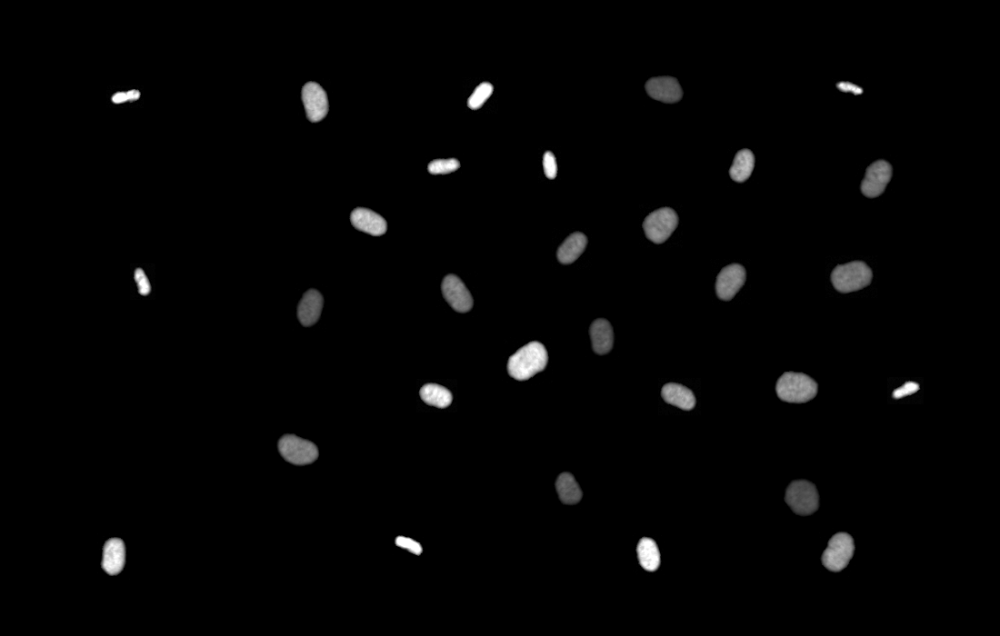

<div align="center">

# The library for Synthetic Live Cell Microscopy Video Generation [SASHIMI 2024 Best Reproducibility Award]
[](https://arxiv.org/abs/2403.17808)
</div>


## 👋 Introduction

This repository contains the source code for Biomedical Video Diffusion Model (BVDM), capable of generating realistic-looking synthetic microscopy videos. Trained only on a single real video, BVDM can generate videos of arbitrary length with pixel-level annotations that can be used for training data-hungry models. It is composed of a denoising diffusion probabilistic model (DDPM) generating high-fidelity synthetic cell microscopy images and a flow prediction model (FPM) predicting the non-rigid transformation between consecutive video frames.

<p align="center">
  
  
</p>

## ⬇️ Installation

You can set up a conda environment as follows:

```bash
# We reccomend using a virtual environment
conda create -n bvdm python=3.8
conda activate bvdm

# Clone the bvdm repository and install in editable mode
git clone https://github.com/ruveydayilmaz0/BVDM.git
cd bvdm
pip install -r requirements.txt
```

## 📚 Data Preparation
BVDM trains on Microscopy videos of [Fluo-N2DL-HeLa cells](https://celltrackingchallenge.net/2d-datasets/). Before training, the training set should be downloaded from there and individual cell images should be extracted using utils/CTC_Fluo_extract_cells.py 

```bash
python utils/CTC_Fluo_extract_cells.py \
--data_root PATH_TO_THE_TRAINING_DATA \
--cell_group CELL_GROUP_TO_BE_EXTRACTED_FROM_THE_DATASET (01 OR 02) \
--new_data_folder SAVE_PATH_FOR_THE_EXTRACTED_IMAGES \
--new_mask_folder SAVE_PATH_FOR_THE_EXTRACTED_MASKS \
```

## 💪 Training
For generating synthetic masks, the statistical shape model from [here](https://github.com/stegmaierj/CellCycleGAN.git) is used. As the flow prediction model, we use [Voxelmorph](https://github.com/voxelmorph/voxelmorph.git) that should be trained with the real masks extracted from the dataset. The trained model weights should be in the folder volxelmorph_ckpt/ of this project.  

For training the DDPM, run:
```bash
python train.py \
--ckpt_path SAVE_PATH_FOR_THE_MODEL_WEIGHTS \
--log_path PATH_TO_SAVE_TRAINING_LOGS \
--gpus GPUS_TO_BE_USED \
--epochs NUMBER_OF_EPOCHS \
--data_root PATH_TO_THE_DATA \
--batch_size TRAINING_BATCH_SIZE
```

## 👁️‍🗨️ Inference

The pretrained model for VoxelMorph is already in voxelmorph_ckpt/. You can download the checkpoint for DDPM from [here](https://drive.google.com/file/d/1h_GWuaSoLhiRIUA7-KjplE3mXFjXLwLI/view?usp=sharing). Then, you can run inference either using directly _inference.py_ or the script _source/CellCycleGAN.m_. The former generates single synthetic images for given synthetic masks as follows:

```bash
python inference.py \
--output_path SAVE_PATH_FOR_THE_MODEL_WEIGHTS \
--masks_path PATH_TO_SAVE_TRAINING_LOGS \
--masks_info GPUS_TO_BE_USED \
--ckpt_path NUMBER_OF_EPOCHS \
--gpus PATH_TO_THE_DATA \
--timesteps_f0 TRAINING_BATCH_SIZE \
--timesteps_f_non0 
```
The latter is able to generate synthetic masks, use _inference.py_ to generate realistic textures and place multiple output synthetic cells into a bigger scene when the configuration given above is inserted in _source/CellCycleGAN.m_.


## 📊 Evaluation

To assess the quality of the generated synthetic images, we use four different metrics:
1. [SEG:](http://celltrackingchallenge.net/evaluation-methodology/) We train [a segmentation algorithm](https://arxiv.org/abs/1805.11247) on the synthetic images and test its performance on real data.
2. [TRA:](http://celltrackingchallenge.net/evaluation-methodology/) We train [a tracking algorithm](https://arxiv.org/abs/2202.04731) on the synthetic videos and test its performance on real data.
3. [FID](https://github.com/universome/stylegan-v) on images
4. [FVD](https://github.com/universome/stylegan-v) on videos

## 🗒️Citation

```tex
@misc{yilmaz2024annotated,
      title={Annotated Biomedical Video Generation using Denoising Diffusion Probabilistic Models and Flow Fields}, 
      author={Rüveyda Yilmaz and Dennis Eschweiler and Johannes Stegmaier},
      year={2024},
      eprint={2403.17808},
      archivePrefix={arXiv},
      primaryClass={eess.IV}
}
```
